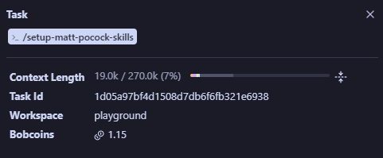
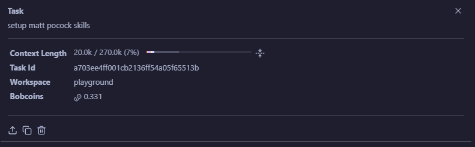
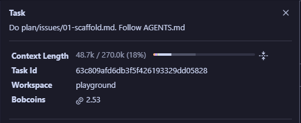
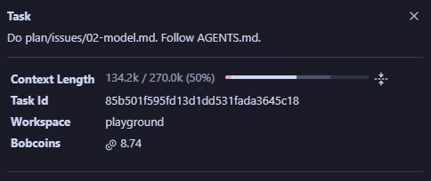
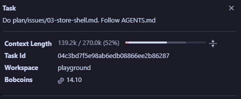
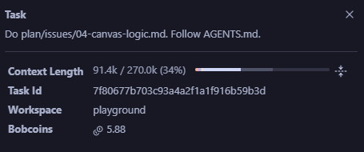
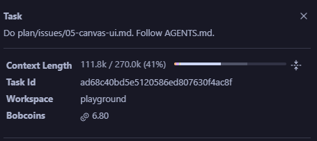
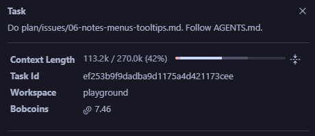
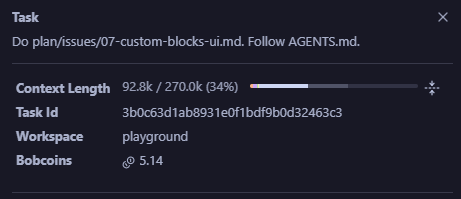
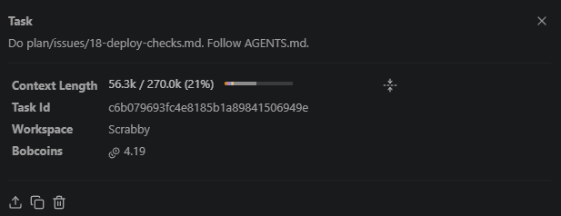

# Bob Development Summary

How the Anvora.id team put IBM Bob to work on Scrabby, our submission to the lablab.ai IBM Bob 2.0 Hackathon.

| Bob sessions | BobCoins spent | Lines of code and tests | Test files | Mode |
|---|---|---|---|---|
| 10 | 56.32 | about 8,100 | 12 | IBM Bob 2.0, Agent mode |

## How we put Bob to work

1. **Plan before code.** We wrote the product plan ([PRD.md](PRD.md)), the technical design ([TDD.md](TDD.md)) and the design system ([DESIGN.md](DESIGN.md)) before Bob wrote a line. Bob built from those documents, not from a chat.
2. **Small, exact context.** A script ([scripts/split-specs.mjs](scripts/split-specs.mjs)) splits the big documents into one file per section under `spec/`. Each issue lists the only files Bob should open, which kept every task between 19k and 139k tokens of context out of 270k, and kept BobCoin use low.
3. **One issue per fresh task.** Every task started in a new Agent-mode session with a one-line prompt: `Do plan/issues/NN-<slug>.md. Follow AGENTS.md.` The issues live in [plan/issues/](plan/issues/).
4. **A shared rulebook.** [AGENTS.md](AGENTS.md) tells Bob what to read, to copy every name and string exactly, to keep tests next to each module, how to commit, the safety rules for keys, and to stop and ask with a `## Question` section instead of guessing.
5. **Done means checked.** A task was only done when `pnpm typecheck` and `pnpm test` passed. The deploy checks Bob built in issue 18 now guard every push and pull request.

## Session log

| # | Session | What Bob built | BobCoins | Context |
|---|---|---|---|---|
| 1 | Repo setup | Agent skills config: issue tracker, triage labels, domain docs | 1.15 | 19.0k |
| 2 | Skills setup | Finished the agent skills setup | 0.33 | 20.0k |
| 3 | [Issue 01](plan/issues/01-scaffold.md) | Scaffold and deploy skeleton | 2.53 | 48.7k |
| 4 | [Issue 02](plan/issues/02-model.md) | Project model and catalogue | 8.74 | 134.2k |
| 5 | [Issue 03](plan/issues/03-store-shell.md) | Store, storage, fixtures and app shell | 14.10 | 139.2k |
| 6 | [Issue 04](plan/issues/04-canvas-logic.md) | Canvas logic | 5.88 | 91.4k |
| 7 | [Issue 05](plan/issues/05-canvas-ui.md) | Canvas UI | 6.80 | 111.8k |
| 8 | [Issue 06](plan/issues/06-notes-menus-tooltips.md) | Notes, menus, tooltips and Bob picks | 7.46 | 113.2k |
| 9 | [Issue 07](plan/issues/07-custom-blocks-ui.md) | Custom Blocks UI | 5.14 | 92.8k |
| 10 | [Issue 18](plan/issues/18-deploy-checks.md) | Deploy checks | 4.19 | 56.3k |

### 1. Repo setup

Set up the agent skills the team works with: the issue tracker, the triage labels and the domain docs.

### 2. Skills setup

A short follow-up session that finished the agent skills setup.

### 3. Issue 01: Scaffold and deploy skeleton

A Vite, React and TypeScript app that runs locally with the app on port 5173 and the Preview origin on port 5174, builds for both Vercel projects, and has a stub for the agent route.

**Key files:** `package.json`, `vite.config.ts`, `vercel.json`, `preview/`, `api/agent.ts`, `src/tokens.css`

### 4. Issue 02: Project model and catalogue

The data model every other part uses: the types, the catalogue of Block and Trait types, the icons, the Project functions (ids, Page files, Custom Blocks with overrides, `applyChange`) and the Library rules. Pure TypeScript with tests.

**Key files:** `src/model/types.ts`, `src/model/catalogue.ts`, `src/model/project.ts`, `src/model/library.ts`, `src/icons.ts`
**Tests:** `project.test.ts`, `library.test.ts`

### 5. Issue 03: Store, storage, fixtures and shell

The app frame and its state: the menu bar, the step bar and the three Steps, the Project store with Undo and Redo, saving to IndexedDB so a Project survives a reload, and the demo fixtures.

**Key files:** `src/store.ts`, `src/history.ts`, `src/db.ts`, `src/fixtures/`, `src/shell/`
**Tests:** `store.test.ts`, `history.test.ts`, `fixtures.test.ts`, `project.test.ts`

### 6. Issue 04: Canvas logic

The pure logic under the Canvas: the rows-and-columns layout tree inside a Block, dropping and removing Blocks and Traits, the drop rules, closest-edge targeting, the "on click" options and the drag store.

**Key files:** `src/canvas/tree.ts`, `src/canvas/target.ts`, `src/canvas/drag.ts`
**Tests:** `tree.test.ts`, `target.test.ts`

### 7. Issue 05: Canvas UI

The Canvas people plan on: the palette with its category column, Blocks that nest and grow, Trait pills edited in place, dragging with a drop indicator (onto the Canvas, between Blocks, or back onto the palette to delete), folding, pan and zoom.

**Key files:** `src/slots/Canvas.tsx`, `src/slots/Palette.tsx`, `src/canvas/BlockView.tsx`, `src/canvas/TraitPill.tsx`

### 8. Issue 06: Notes, menus, tooltips and Bob picks

The right-click menu on Blocks and Traits, Notes, one-sentence tooltips on everything, and "Bob picks", which hands any Trait's value to Bob.

**Key files:** `src/canvas/Overlays.tsx`, `src/canvas/menu.ts`, `src/canvas/tooltip.ts`, `src/canvas/bobPicks.ts`
**Tests:** `menu.test.ts`, `tooltip.test.ts`, `bobPicks.test.ts`

### 9. Issue 07: Custom Blocks UI

Custom Blocks on screen: My Blocks in the palette, the edit view with its bar, Instances in their own color with an Edit pill, and the markers that show where an Instance differs from its Custom Block.

**Key files:** `src/slots/Palette.tsx`, `src/canvas/BlockView.tsx`, `src/slots/Canvas.tsx`

### 10. Issue 18: Deploy checks

One command, `pnpm check`, that says whether the repo is safe to deploy: no key in any file or anywhere in the git history, the AGENTS.md safety rules hold, the config matches the technical design, and the type check, the tests and both builds pass. A pre-push hook runs it before every push, and a GitHub Actions workflow runs it on every pull request into `main`.

**Key files:** `scripts/check.ts`, `scripts/guard.ts`, `.githooks/pre-push`, `.github/workflows/check.yml`
**Tests:** `guard.test.ts`

## Bob inside Scrabby

Bob is not only how Scrabby was built. It is also what Scrabby runs on.

- **Every Build and every Assistant answer** goes through the app's `/api/agent` route to IBM Bob's inference endpoint. Bob writes the website through tool calls, file by file.
- **Bob follows its own Skills.** The files in [skills/](skills/) teach the product's Bob how to write a good site: code rules, layout, behavior, content and visual style, on top of a shared `base.css`.
- **Usage limits protect the budget.** Each browser gets 10 Builds and 40 questions an hour, and everyone shares 40 Builds and 150 questions a day. Every run carries its own id, so a repeated request never runs twice.
- **25 BobCoins are kept for users,** so people trying Scrabby can plan, build and change their website with Bob.

The plan, the rulebook, the issues and the checks are all in this repo, so anyone can see exactly how Bob helped build Scrabby.
