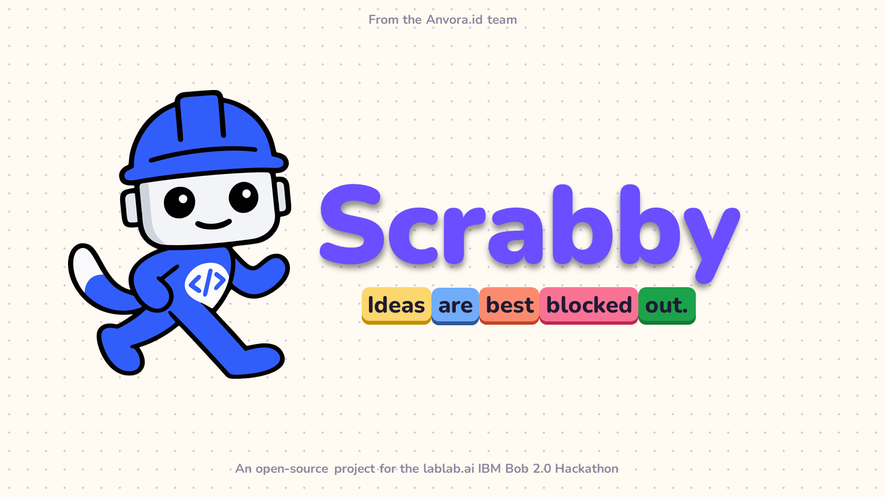

<p align="center">
  
</p>

<p align="center">
  <a href="https://scrabby-two.vercel.app"></a>
  <a href="LICENSE"></a>
  
  
</p>

<p align="center"><strong>Plan it. Build it. Click it.</strong></p>

Scrabby is a web IDE that lets young developers plan a website the way they already code: by snapping Blocks and Traits together on a Canvas. Bob, powered by IBM Bob, turns that plan into a real website in plain HTML, CSS and JavaScript that they can click through, edit and ask questions about.

Scrabby is our open-source submission to the **lablab.ai IBM Bob 2.0 Hackathon**.

<p align="center">
  <a href="https://scrabby-two.vercel.app">Live app</a> ·
  <a href="Bob_Development_Summary.md">Bob Development Summary</a> ·
  <a href="PRD.md">Product plan</a> ·
  <a href="TDD.md">Technical design</a> ·
  <a href="DESIGN.md">Design system</a>
</p>

## Why Scrabby

Kids who code are developers too, and their first workflow is planning: getting from an idea to working code. AI can now build a real website, but only for people who can describe exactly what they want in words. Young developers have the ideas. What they are missing is the perfect prompt.

- When students aged 14 and 15 asked ChatGPT questions in their own words, 39% of the answers they got were high-level ones, against 84% with expert-written prompts ([Abdelghani et al., 2025](https://arxiv.org/abs/2505.01106)).
- Only 27% of US eighth graders reached the Proficient level in the latest national writing assessment ([NCES, 2012](https://nces.ed.gov/nationsreportcard/pdf/main2011/2012470.pdf)).

Scrabby removes the prompt-writing barrier. Kids give their intent as structure, in the block-based style they already know, and Bob does the wording.

## How it works

1. **Plan.** Snap the idea together as Blocks (Pages, sections, cards, buttons, forms) and Traits (color, font, vibe, what a click does) on a Canvas. It feels like a game.
2. **Build.** Bob reads the plan and writes a real website in plain HTML, CSS and JavaScript. Every Build is saved as a Checkpoint you can name and return to.
3. **Try & tweak.** Click through the site in a live Preview, edit the real code, and ask Bob what any part of it does. Hand edits survive every rebuild.

## Made with IBM Bob

We treated Bob like a teammate with a clear brief. Before any code existed, we wrote the product plan, the technical design and the design system, then split them into small spec files so each task loaded only what it needed. Every task started fresh in Agent mode with one issue and a shared rulebook ([AGENTS.md](AGENTS.md)) covering naming, tests, safety and when to stop and ask.

That discipline kept Bob focused and efficient: 10 sessions and about 56 BobCoins produced Scrabby's foundation, from the scaffold and data model to the Canvas, Custom Blocks and the deploy checks that guard every push. Bob also runs inside the product: every Build and every Assistant answer goes through IBM Bob, and we kept 25 BobCoins so people using Scrabby can build with Bob too.

Session by session: [Bob Development Summary](Bob_Development_Summary.md).

## Tech stack

**Built with:** IBM Bob (IDE and Agent mode), GitHub and Vercel.

**App:** React 19, TypeScript, Vite, CodeMirror 6, Phosphor Icons, idb (IndexedDB storage) and fflate (zip downloads).

**Quality:** Vitest, plus a `pnpm check` deploy gate that scans for keys, checks the safety rules, and runs the type check, the tests and both builds before every push and on every pull request.

**Runtime:** an `/api/agent` Vercel Function that calls IBM Bob's inference endpoint, and a separate Preview origin that runs each built site in isolation.

## Getting started

**Requirements:** Node.js 22 or later, pnpm 9 and an IBM Bob inference API key.

```bash
git clone https://github.com/Anvora-id/Scrabby.git
cd Scrabby
pnpm install
cp .env.example .env    # then set AGENT_API_KEY
pnpm dev
```

The app runs on http://localhost:5173 and the Preview on http://localhost:5174.

| Command | What it does |
|---|---|
| `pnpm dev` | Runs the app, the Preview and the agent route locally |
| `pnpm test` | Runs the test suite |
| `pnpm typecheck` | Type-checks the project |
| `pnpm build` | Builds the app into `dist` |
| `pnpm build:preview` | Builds the Preview into `dist-preview` |
| `pnpm check` | Runs every deploy check |
| `pnpm build-demo` | Runs one real Build of the demo into `tmp/demo-site/` |

Run `git config core.hooksPath .githooks` once after cloning. Every `git push` then runs `pnpm check` first, and GitHub runs the same check on every pull request into `main`.

<details>
<summary><strong>Configuration</strong></summary>

<br>

Set these in `.env` for local development. `.env` is git-ignored; never commit a key, and never give a secret a `VITE_` prefix.

| Variable | Default | Purpose |
|---|---|---|
| `AGENT_API_KEY` | required | IBM Bob inference API key. Server only. |
| `AGENT_BASE_URL` | `https://api.us-east.bob.ibm.com/inference/v1` | OpenAI-compatible base URL. |
| `AGENT_AUTH_SCHEME` | `Apikey` | Authorization scheme for the key. |
| `AGENT_MODEL` | `premium` | Model id. |
| `AGENT_HEADERS` | `{}` | Optional extra request headers, as JSON. |
| `AGENT_REASONING_EFFORT` | `low` | Reasoning effort sent with every request. |
| `AGENT_LABEL` | `IBM Bob` | Name shown on the Bob badge. |
| `AGENT_LIMITS` | on | Set to `off` to disable usage limits in local development. |
| `FALLBACK_API_KEY` | none | Turns on the optional fallback model. Server only. |
| `FALLBACK_BASE_URL`, `FALLBACK_AUTH_SCHEME`, `FALLBACK_MODEL`, `FALLBACK_HEADERS`, `FALLBACK_LABEL` | Gemini defaults | Endpoint, model and badge name of the fallback. |
| `VITE_PREVIEW_ORIGIN` | `http://<host>:5174` | App build: where the Preview lives. |
| `VITE_APP_ORIGIN` | `http://<host>:5173` | Preview build: the only origin the Preview accepts files from. |

If a call to Bob fails (a network error, 403, 429 or 5xx), that run carries on with the fallback model and the badge shows the fallback's name. The next run tries Bob again. Without `FALLBACK_API_KEY`, a failed call ends the run.

</details>

<details>
<summary><strong>Deploying to Vercel</strong></summary>

<br>

Scrabby deploys as two Vercel projects from this repo, each pointing at the other:

| Project | Build command | Output | Environment variables |
|---|---|---|---|
| `scrabby` (the app) | `pnpm build` | `dist` | `AGENT_API_KEY` (Sensitive), the other `AGENT_*` values, optional `FALLBACK_*` values, and `VITE_PREVIEW_ORIGIN` set to the Preview project's URL |
| `scrabby-preview` | `pnpm build:preview` | `dist-preview` | `VITE_APP_ORIGIN` set to the app project's URL |

Domains, variables and deploy warnings are covered in [docs/deploy.md](docs/deploy.md). See [SECURITY.md](SECURITY.md) for how keys are handled.

</details>

## Roadmap

- **Sound and video Traits.** The two Content Traits we cut from the hackathon build.
- **Games.** Today Scrabby makes websites and simple web apps. Games come next.

## Team

Scrabby is built by the Anvora.id team.

| Name | Role | Links |
|---|---|---|
| Derick | Product Developer, Designer and QA | [GitHub](https://github.com/Kreeespy) · [LinkedIn](https://www.linkedin.com/in/derick-widjaja-a968ab393/) |
| Kent Wilbert Wijaya | Technical Developer | [GitHub](https://github.com/Convects) · [LinkedIn](https://www.linkedin.com/in/kent-wilbert-wijaya/) |

## License and acknowledgements

Scrabby is released under the [Apache License 2.0](LICENSE).

- Built for the IBM Bob 2.0 Hackathon, hosted by lablab.ai. Thank you to lablab.ai and IBM for the challenge and for Bob.
- The demo photos come from Unsplash. Each photographer is credited in [public/demo/CREDITS.md](public/demo/CREDITS.md).
- Icons by [Phosphor Icons](https://phosphoricons.com).

<details>
<summary><strong>References</strong></summary>

<br>

- Abdelghani, R., Murayama, K., Kidd, C., Sauzéon, H., and Oudeyer, P.-Y. (2025). *The illusion of understanding: How middle-schoolers fail to regulate inquiry with ChatGPT in a science task.* arXiv preprint 2505.01106. [arxiv.org/abs/2505.01106](https://arxiv.org/abs/2505.01106)
- Kazemitabaar, M., Hou, X., Henley, A. Z., Ericson, B. J., Weintrop, D., and Grossman, T. (2023). *How novices use LLM-based code generators to solve CS1 coding tasks in a self-paced learning environment.* Koli Calling '23. [PDF](https://austinhenley.com/pubs/Kazemitabaar2023Koli_LLMsCS1.pdf)
- Masson, D., Malacria, S., Casiez, G., and Vogel, D. (2024). *DirectGPT: A direct manipulation interface to interact with large language models.* CHI '24. [arxiv.org/abs/2310.03691](https://arxiv.org/abs/2310.03691)
- National Center for Education Statistics. (2012). *The Nation's Report Card: Writing 2011* (NCES 2012-470). U.S. Department of Education. [PDF](https://nces.ed.gov/nationsreportcard/pdf/main2011/2012470.pdf)
- Negreiro, M. (2025). *Children and generative AI* [Briefing]. European Parliamentary Research Service. [epthinktank.eu](https://epthinktank.eu/2025/02/21/children-and-generative-ai/)
- Zhou, Y., Muresanu, A. I., Han, Z., Paster, K., Pitis, S., Chan, H., and Ba, J. (2023). *Large language models are human-level prompt engineers.* ICLR 2023. [arxiv.org/abs/2211.01910](https://arxiv.org/abs/2211.01910)

</details>
